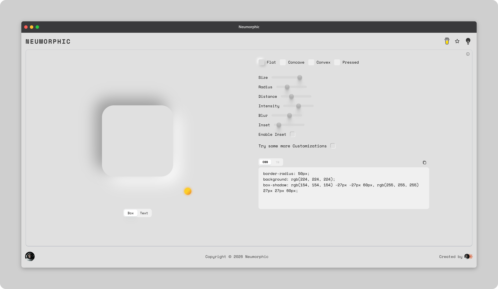
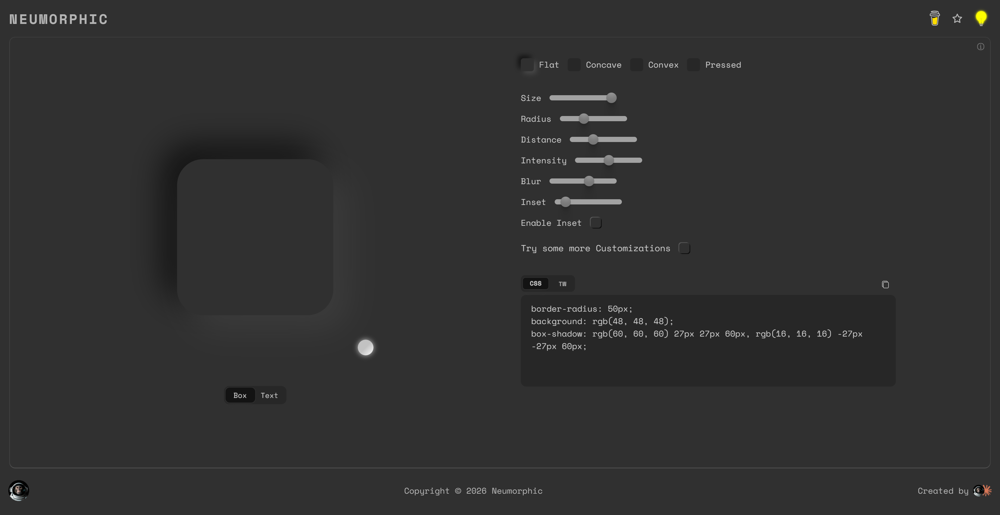

# [Neumorphic](https://praashoo7.github.io/Neumorphic/)
I started building this to try adding some things I wanted in other similar tools used for generating "Shadows", but then it turned out that I needed much more! 
For some of the optimization and logical part claude took over and it is designed by yours truly.

## Credits

  - Space Mono font from [Google.](https://fonts.google.com/specimen/Space+Mono)
  - Inspired from [neumorphism.io](https://neumorphism.io/).
  - Shadow types are gathered from around the Internet.

## License

Neumorphic is open-source Software Licensed under the [MIT License](https://github.com/Praashoo7/Neumorphic/blob/main/LICENSE)
